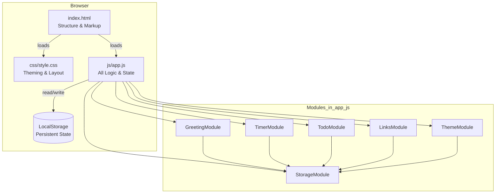
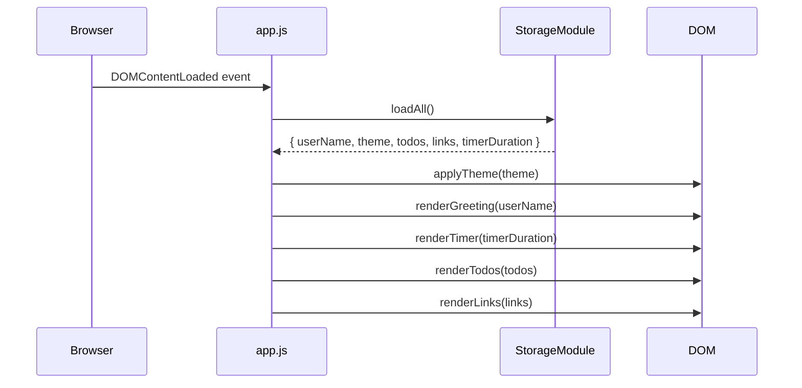
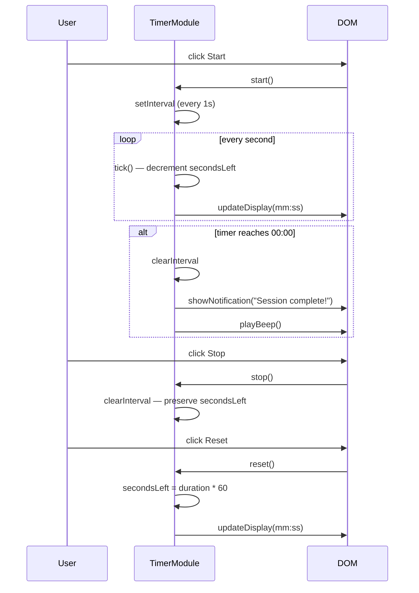
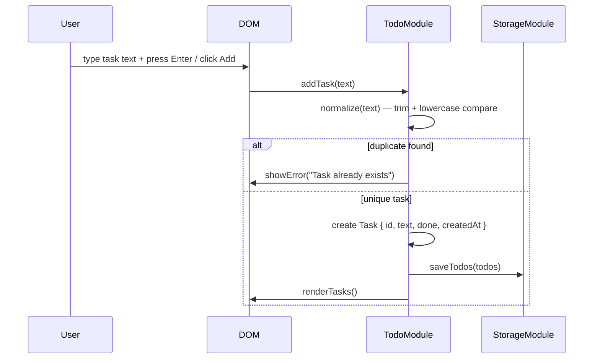
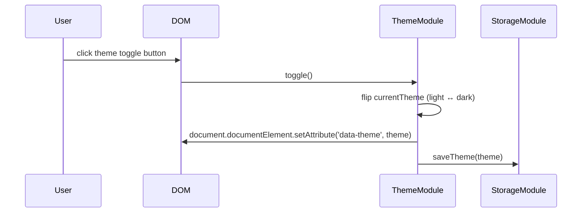

# Design Document: Focus Dashboard

## Overview

Focus Dashboard is a standalone client-side productivity web application built with plain HTML, CSS, and Vanilla JavaScript. It provides a unified interface for tracking time (Pomodoro timer), managing tasks, storing quick-access links, and displaying a personalized greeting — all persisted locally via the browser's LocalStorage API.

The application runs entirely in the browser with no build step, no backend, and no external dependencies. A single `index.html` at the root loads one CSS file (`css/style.css`) and one JavaScript file (`js/app.js`). Light/Dark mode, a custom user name, and duplicate-task prevention are included as challenge features.

The design targets modern evergreen browsers (Chrome, Firefox, Edge, Safari) and can be opened directly from the file system or served from any static host.

---

## Architecture



All application logic lives in `js/app.js`, structured as immediately-invoked function expressions (IIFEs) or plain module objects to avoid polluting the global namespace. There is no build step — the browser interprets the file directly.

---

## Sequence Diagrams

### App Initialization



### Pomodoro Timer Flow



### Add Task with Duplicate Prevention



### Theme Toggle



---

## Components and Interfaces

### StorageModule

**Purpose**: Single access point for all LocalStorage reads and writes. Serializes/deserializes JSON and provides typed defaults.

**Interface**:
```javascript
const StorageModule = {
  // Keys
  KEYS: {
    USER_NAME:      'fd_userName',
    THEME:          'fd_theme',
    TODOS:          'fd_todos',
    LINKS:          'fd_links',
    TIMER_DURATION: 'fd_timerDuration',
  },

  get(key, defaultValue),       // returns parsed JSON or defaultValue
  set(key, value),              // serializes value and writes to localStorage
  remove(key),                  // removes a key
  loadAll(),                    // returns { userName, theme, todos, links, timerDuration }
}
```

**Responsibilities**:
- Wrap `localStorage.getItem` / `localStorage.setItem` with JSON parse/stringify
- Provide typed default values when a key is absent
- Expose a `loadAll()` convenience method for initialization

---

### GreetingModule

**Purpose**: Renders a time-aware greeting and allows the user to set/edit their display name.

**Interface**:
```javascript
const GreetingModule = {
  init(userName),               // render greeting; bind name-edit UI
  getGreetingPhrase(),          // returns "Good morning|afternoon|evening|night"
  formatDateTime(),             // returns { time: "HH:MM", date: "Weekday, Month D, YYYY" }
  setUserName(name),            // trim, validate, save, re-render
  startClock(),                 // setInterval every 30s to refresh time display
}
```

**Responsibilities**:
- Determine greeting based on current hour (0–5 night, 6–11 morning, 12–17 afternoon, 18–23 evening)
- Update the time/date display every 30 seconds
- Allow inline name editing via a click-to-edit pattern

---

### TimerModule

**Purpose**: Manages the Pomodoro countdown timer with start, stop, and reset controls.

**Interface**:
```javascript
const TimerModule = {
  init(durationMinutes),        // set initial state, bind buttons, render display
  start(),                      // begin countdown interval
  stop(),                       // pause countdown, preserve remaining time
  reset(),                      // restore to full duration, clear interval
  tick(),                       // decrement secondsLeft; handle completion
  updateDisplay(),              // format mm:ss and write to DOM
  setDuration(minutes),         // validate, save, reset timer to new duration
  onComplete(),                 // play beep, show notification, reset state
}
```

**State**:
```javascript
{
  durationMinutes: 25,   // configurable
  secondsLeft: 1500,     // durationMinutes * 60
  intervalId: null,      // reference to setInterval handle
  isRunning: false,
}
```

**Responsibilities**:
- Countdown accuracy to the second using `setInterval`
- Enforce that `durationMinutes` is between 1 and 60
- Update `<title>` with remaining time while running (bonus UX)
- Fire browser Notification API (if permitted) and a Web Audio API beep on completion

---

### TodoModule

**Purpose**: Full CRUD task list with duplicate prevention and sort capability.

**Interface**:
```javascript
const TodoModule = {
  init(todos),                  // load tasks, bind form, render list
  addTask(text),                // validate, deduplicate, create, persist, render
  editTask(id, newText),        // validate, deduplicate (excluding self), persist, render
  toggleDone(id),               // flip done flag, persist, render
  deleteTask(id),               // remove by id, persist, render
  renderTasks(),                // clear and rebuild DOM list from state
  normalize(text),              // trim + collapse whitespace + lowercase (for comparison)
  isDuplicate(text, excludeId), // returns true if normalized text matches any existing task
  sortTasks(by),                // 'date' | 'name' | 'status' — sort in-place, render
}
```

**Task shape**:
```javascript
{
  id: string,          // crypto.randomUUID() or Date.now().toString()
  text: string,        // raw user input, trimmed
  done: boolean,
  createdAt: number,   // Date.now()
}
```

**Responsibilities**:
- Duplicate detection: compare `normalize(newText)` against `normalize(task.text)` for all existing tasks (excluding the task being edited)
- Inline edit: replace task text with an `<input>` field; confirm on Enter or blur
- Persist after every mutation

---

### LinksModule

**Purpose**: Manages a collection of quick-access link buttons that open in a new tab.

**Interface**:
```javascript
const LinksModule = {
  init(links),                  // render link buttons, bind add-link form
  addLink(label, url),          // validate URL, check duplicate URL, persist, render
  deleteLink(id),               // remove by id, persist, render
  renderLinks(),                // rebuild link buttons from state
  validateUrl(url),             // returns true if URL is parseable by new URL()
}
```

**Link shape**:
```javascript
{
  id: string,
  label: string,    // display text on the button
  url: string,      // full URL including protocol
}
```

**Responsibilities**:
- Each link renders as a `<button>` or `<a>` with `target="_blank" rel="noopener noreferrer"`
- Validate URL format before saving
- Provide a delete control per link

---

### ThemeModule

**Purpose**: Manages light/dark mode via a CSS custom property strategy driven by `data-theme` on `<html>`.

**Interface**:
```javascript
const ThemeModule = {
  init(savedTheme),             // apply theme, update toggle button icon
  toggle(),                     // flip theme, persist, update icon
  apply(theme),                 // set data-theme attribute on documentElement
  getPreferred(),               // returns 'dark' if prefers-color-scheme: dark, else 'light'
}
```

**Responsibilities**:
- Read OS preference via `window.matchMedia('(prefers-color-scheme: dark)')` as fallback default
- Persist user's manual choice to override OS preference
- Update toggle button aria-label and icon on every change

---

## Data Models

### AppState (in-memory, loaded from LocalStorage on init)

```javascript
const AppState = {
  userName: '',           // string, default ''
  theme: 'light',        // 'light' | 'dark'
  timerDuration: 25,     // number, 1–60
  todos: [],             // Task[]
  links: [],             // Link[]
}
```

### Task

```javascript
/**
 * @typedef {Object} Task
 * @property {string}  id         - Unique identifier
 * @property {string}  text       - Task description (trimmed)
 * @property {boolean} done       - Completion status
 * @property {number}  createdAt  - Unix timestamp (ms)
 */
```

**Validation Rules**:
- `text` must be non-empty after trimming
- `text` normalized must not match any existing task's normalized text (duplicate prevention)
- `id` must be unique across all tasks

### Link

```javascript
/**
 * @typedef {Object} Link
 * @property {string} id     - Unique identifier
 * @property {string} label  - Button display text (non-empty)
 * @property {string} url    - Valid absolute URL
 */
```

**Validation Rules**:
- `url` must be parseable by `new URL(url)` (throws on invalid)
- `label` must be non-empty after trimming
- `url` should not duplicate an existing link's URL

---

## Algorithmic Pseudocode

### Main Initialization Algorithm

```javascript
// ALGORITHM: init
// INPUT:  DOMContentLoaded event
// OUTPUT: fully rendered dashboard

function init() {
  const state = StorageModule.loadAll()
  // Precondition: state has valid defaults for all keys

  ThemeModule.init(state.theme)
  GreetingModule.init(state.userName)
  TimerModule.init(state.timerDuration)
  TodoModule.init(state.todos)
  LinksModule.init(state.links)

  // Postcondition: all UI sections rendered; event listeners attached
}

document.addEventListener('DOMContentLoaded', init)
```

**Preconditions**: DOM is fully parsed; `localStorage` is accessible (not blocked by private-mode restrictions)
**Postconditions**: All widgets visible; state loaded from storage or defaults applied

---

### Timer Tick Algorithm

```javascript
// ALGORITHM: tick
// INPUT:  called every 1000ms by setInterval
// OUTPUT: updated display; or completion side-effects

function tick() {
  // Precondition: isRunning === true AND secondsLeft > 0
  state.secondsLeft -= 1

  updateDisplay()
  document.title = `(${formatMMSS(state.secondsLeft)}) Focus Dashboard`

  if (state.secondsLeft === 0) {
    clearInterval(state.intervalId)
    state.intervalId = null
    state.isRunning = false
    onComplete()
    // Loop invariant satisfied: secondsLeft was decremented each tick
    // Postcondition: secondsLeft === 0; isRunning === false; onComplete called
  }
}
```

**Loop Invariant**: `secondsLeft` decreases by exactly 1 per tick; `secondsLeft >= 0` always holds
**Postconditions**: When loop ends, `secondsLeft === 0`; timer state is cleaned up; `onComplete()` fires exactly once

---

### Duplicate Detection Algorithm

```javascript
// ALGORITHM: isDuplicate
// INPUT:  text (string), excludeId (string | null)
// OUTPUT: boolean

function normalize(text) {
  // Precondition: text is a string
  return text.trim().replace(/\s+/g, ' ').toLowerCase()
  // Postcondition: returns canonical form for comparison
}

function isDuplicate(text, excludeId = null) {
  // Precondition: todos is an array; text is a non-empty string
  const normalizedNew = normalize(text)

  for (const task of state.todos) {
    if (task.id === excludeId) continue   // skip self during edit
    if (normalize(task.text) === normalizedNew) return true
  }

  return false
  // Postcondition: returns true IFF any non-excluded task normalizes to the same value
}
```

**Preconditions**: `text` is a non-empty string; `state.todos` is initialized
**Postconditions**: Returns `true` if duplicate exists; `false` otherwise; no mutations to state

**Loop Invariant**: All tasks examined before current index have been compared; result accumulates correctly

---

### Add Task Algorithm

```javascript
// ALGORITHM: addTask
// INPUT:  text (string from input field)
// OUTPUT: new Task added to state and DOM; or error shown

function addTask(text) {
  const trimmed = text.trim()

  if (trimmed.length === 0) {
    showError('Task cannot be empty')
    return
  }

  if (isDuplicate(trimmed)) {
    showError('Task already exists')
    return
  }

  const task = {
    id: generateId(),
    text: trimmed,
    done: false,
    createdAt: Date.now(),
  }

  state.todos.push(task)
  StorageModule.set(StorageModule.KEYS.TODOS, state.todos)
  renderTasks()
  clearInput()

  // Postcondition: state.todos.length increased by 1; task persisted; DOM updated
}
```

---

### StorageModule.loadAll Algorithm

```javascript
// ALGORITHM: loadAll
// INPUT:  none (reads from localStorage)
// OUTPUT: AppState object with all fields populated

function loadAll() {
  return {
    userName:      get(KEYS.USER_NAME,      ''),
    theme:         get(KEYS.THEME,          ThemeModule.getPreferred()),
    timerDuration: get(KEYS.TIMER_DURATION, 25),
    todos:         get(KEYS.TODOS,          []),
    links:         get(KEYS.LINKS,          []),
  }
  // Postcondition: all fields are present and type-safe with defaults
}
```

---

## Key Functions with Formal Specifications

### `TimerModule.setDuration(minutes)`

```javascript
function setDuration(minutes) { ... }
```

**Preconditions**:
- `minutes` is a finite number
- `minutes >= 1 && minutes <= 60`

**Postconditions**:
- `state.durationMinutes === minutes`
- `state.secondsLeft === minutes * 60`
- Timer is not running (`isRunning === false`)
- New duration persisted to LocalStorage
- Display updated to show `mm:00`

**Error Handling**: If `minutes` is out of range, clamp to `[1, 60]` and show a validation message

---

### `TodoModule.editTask(id, newText)`

```javascript
function editTask(id, newText) { ... }
```

**Preconditions**:
- A task with `id` exists in `state.todos`
- `newText` is a non-empty string after trimming

**Postconditions**:
- `task.text === newText.trim()` for the matching task
- No other task is a duplicate of `newText` (excluding the edited task itself)
- State persisted; DOM re-rendered

**Error Handling**: If duplicate detected (excluding self), revert input to original text and show error

---

### `GreetingModule.getGreetingPhrase()`

```javascript
function getGreetingPhrase() { ... }
```

**Preconditions**: System clock is accessible

**Postconditions**:
- Returns exactly one of: `"Good morning"`, `"Good afternoon"`, `"Good evening"`, `"Good night"`
- Mapping: `0–5 → "Good night"`, `6–11 → "Good morning"`, `12–17 → "Good afternoon"`, `18–23 → "Good evening"`

---

### `ThemeModule.toggle()`

```javascript
function toggle() { ... }
```

**Preconditions**: `currentTheme` is `'light'` or `'dark'`

**Postconditions**:
- `currentTheme` is the opposite of its prior value
- `document.documentElement.dataset.theme` matches the new value
- New theme persisted to LocalStorage
- Toggle button aria-label and icon updated

---

## Example Usage

```javascript
// --- Initialization ---
document.addEventListener('DOMContentLoaded', () => {
  const state = StorageModule.loadAll()
  ThemeModule.init(state.theme)
  GreetingModule.init(state.userName)
  TimerModule.init(state.timerDuration)
  TodoModule.init(state.todos)
  LinksModule.init(state.links)
})

// --- Timer interaction ---
document.getElementById('btn-start').addEventListener('click', () => TimerModule.start())
document.getElementById('btn-stop').addEventListener('click', ()  => TimerModule.stop())
document.getElementById('btn-reset').addEventListener('click', () => TimerModule.reset())

// --- Add task ---
document.getElementById('todo-form').addEventListener('submit', (e) => {
  e.preventDefault()
  const input = document.getElementById('todo-input')
  TodoModule.addTask(input.value)
})

// --- Theme toggle ---
document.getElementById('theme-toggle').addEventListener('click', () => ThemeModule.toggle())

// --- Add link ---
document.getElementById('link-form').addEventListener('submit', (e) => {
  e.preventDefault()
  const label = document.getElementById('link-label').value
  const url   = document.getElementById('link-url').value
  LinksModule.addLink(label, url)
})

// --- Set user name ---
document.getElementById('name-input').addEventListener('change', (e) => {
  GreetingModule.setUserName(e.target.value)
})
```

---

## Correctness Properties

*A property is a characteristic or behavior that should hold true across all valid executions of a system — essentially, a formal statement about what the system should do. Properties serve as the bridge between human-readable specifications and machine-verifiable correctness guarantees.*

### Property 1: No duplicate tasks after addTask

*For any* task list and any non-empty text string, if `addTask(text)` succeeds, then `state.todos` contains exactly one task whose `Normalized_Text` matches `normalize(text)`.

**Validates: Requirements 4.1, 4.2**

---

### Property 2: Whitespace-only and empty inputs are rejected

*For any* string composed entirely of whitespace characters (or the empty string), calling `addTask`, `editTask`, `addLink`, or `setUserName` with that string SHALL leave the corresponding state array unchanged and return an error.

**Validates: Requirements 2.5, 4.3, 5.4**

---

### Property 3: Task toggle idempotence (round-trip)

*For any* task with any `done` value, calling `toggleDone(id)` twice in succession SHALL restore `done` to its original value, and `state.todos` SHALL be persisted after each call.

**Validates: Requirements 4.7**

---

### Property 4: Task deletion removes the task

*For any* task present in `state.todos`, after calling `deleteTask(id)` no task with that `id` SHALL remain in `state.todos`, and the persisted list SHALL reflect the removal.

**Validates: Requirements 4.8**

---

### Property 5: Sort correctness for all orderings

*For any* non-empty task list, calling `sortTasks('name')` SHALL produce tasks in case-insensitive alphabetical order by `text`; `sortTasks('date')` SHALL produce tasks in ascending `createdAt` order; `sortTasks('status')` SHALL place all incomplete tasks before all complete tasks.

**Validates: Requirements 4.9**

---

### Property 6: Edit duplicate prevention excludes self

*For any* task being edited, if the proposed `newText` normalizes to the same value as a *different* existing task, the edit SHALL be rejected; if it normalizes to the same value as the task being edited itself, the edit SHALL succeed.

**Validates: Requirements 4.6**

---

### Property 7: Timer tick decrements exactly one per call

*For any* timer state where `isRunning === true` and `secondsLeft > 0`, calling `tick()` once SHALL decrease `secondsLeft` by exactly 1 and update the display accordingly.

**Validates: Requirements 3.2**

---

### Property 8: Timer secondsLeft invariant

*For any* sequence of `start()`, `stop()`, `reset()`, and `tick()` calls in any order, `state.secondsLeft` SHALL always remain in the range `[0, durationMinutes × 60]`.

**Validates: Requirements 3.5, 3.9**

---

### Property 9: Duration clamping

*For any* numeric input `n` passed to `setDuration(n)`, `state.durationMinutes` SHALL be `max(1, min(60, n))` and `state.secondsLeft` SHALL equal `state.durationMinutes × 60`.

**Validates: Requirements 3.7, 3.8**

---

### Property 10: Timer display format matches state

*For any* value of `state.secondsLeft` in `[0, 3600]`, calling `updateDisplay()` SHALL set the display text to exactly `formatMMSS(state.secondsLeft)`, where `formatMMSS` zero-pads both minutes and seconds to two digits.

**Validates: Requirements 3.1, 3.2**

---

### Property 11: Timer title format while running

*For any* value of `state.secondsLeft` while the timer is running, the browser `<title>` SHALL be exactly `"(MM:SS) Focus Dashboard"` where `MM:SS` matches `formatMMSS(state.secondsLeft)`.

**Validates: Requirements 3.3**

---

### Property 12: Greeting phrase covers all 24 hours

*For any* integer hour in `[0, 23]`, `getGreetingPhrase()` SHALL return exactly one of `"Good night"` (0–5), `"Good morning"` (6–11), `"Good afternoon"` (12–17), or `"Good evening"` (18–23), with no hour mapping to more than one phrase.

**Validates: Requirements 2.1**

---

### Property 13: DateTime formatter output format

*For any* `Date` object, `formatDateTime()` SHALL return an object whose `time` field matches the pattern `HH:MM` (24-hour, zero-padded) and whose `date` field matches the pattern `Weekday, Month D, YYYY`.

**Validates: Requirements 2.2**

---

### Property 14: User name round-trip persistence

*For any* non-empty, non-whitespace string `name`, calling `setUserName(name)` followed by a simulated page reload (i.e., `StorageModule.get(KEYS.USER_NAME)`) SHALL return a value equal to `name.trim()`.

**Validates: Requirements 2.4, 2.6**

---

### Property 15: Theme toggle round-trip

*For any* starting theme value in `{'light', 'dark'}`, calling `ThemeModule.toggle()` twice SHALL restore `currentTheme`, `document.documentElement`'s `data-theme` attribute, and the persisted value to their original states.

**Validates: Requirements 6.3, 6.4**

---

### Property 16: Theme persistence on reload

*For any* theme in `{'light', 'dark'}`, after `ThemeModule.apply(theme)` persists the value, `StorageModule.get(KEYS.THEME)` SHALL return that same theme value.

**Validates: Requirements 6.2, 6.4**

---

### Property 17: URL validation rejects non-parseable URLs

*For any* string `url` for which `new URL(url)` throws a `TypeError`, `LinksModule.addLink(label, url)` SHALL not add any entry to `state.links` and SHALL return an error.

**Validates: Requirements 5.2**

---

### Property 18: Duplicate URL rejection

*For any* URL already present in `state.links`, calling `addLink(label, url)` with that same URL SHALL leave `state.links` unchanged and return a duplicate error.

**Validates: Requirements 5.3**

---

### Property 19: Link deletion removes the link

*For any* link present in `state.links`, after calling `deleteLink(id)` no link with that `id` SHALL remain in `state.links`, and the persisted list SHALL reflect the removal.

**Validates: Requirements 5.6**

---

### Property 20: AppState serialization round-trip

*For any* valid `AppState` value, calling `StorageModule.set(key, value)` followed by `StorageModule.get(key, null)` SHALL return a value that deep-equals the original `value`.

**Validates: Requirements 7.1, 7.2, 7.5**

---

### Property 21: Default values for absent keys

*For any* LocalStorage key that has not been written, calling `StorageModule.get(key, defaultValue)` SHALL return `defaultValue` without throwing, regardless of the type of `defaultValue`.

**Validates: Requirements 1.3, 7.3**

---

### Property 22: LocalStorage failure isolation

*For any* `StorageModule` operation (get or set), if the underlying `localStorage` call throws, THE StorageModule SHALL catch the exception and the calling module SHALL continue operating with its current in-memory state without any uncaught error propagating.

**Validates: Requirements 8.1**

---

## Error Handling

### Error Scenario 1: LocalStorage Unavailable

**Condition**: `localStorage` throws (e.g., Safari private mode, storage quota exceeded)
**Response**: Wrap all `localStorage` calls in `try/catch`; fall back to in-memory state
**Recovery**: App works for the session; data is not persisted; no crash shown to user

### Error Scenario 2: Duplicate Task Submitted

**Condition**: `isDuplicate(text)` returns `true` on `addTask` or `editTask`
**Response**: Display an inline error message below the input field
**Recovery**: Input remains focused with existing text; user can modify and resubmit

### Error Scenario 3: Invalid Timer Duration

**Condition**: User enters a non-numeric or out-of-range value (< 1 or > 60) in the duration field
**Response**: Clamp value to `[1, 60]`; show a brief validation tooltip
**Recovery**: Timer resets to clamped value; normal operation resumes

### Error Scenario 4: Invalid URL for Quick Link

**Condition**: `new URL(url)` throws during `LinksModule.validateUrl(url)`
**Response**: Show inline error "Please enter a valid URL (include https://)"
**Recovery**: Form stays open; user can correct the URL

### Error Scenario 5: Empty Task or Link Input

**Condition**: User submits a blank (or whitespace-only) value
**Response**: Show inline validation message; do not mutate state
**Recovery**: Input receives focus; user can type valid content

---

## Testing Strategy

### Unit Testing Approach

Key pure functions to unit test:
- `normalize(text)` — edge cases: extra spaces, mixed case, leading/trailing whitespace
- `isDuplicate(text, excludeId)` — with empty list, exact match, case-insensitive match, self-exclusion
- `getGreetingPhrase()` — all 24 hours boundary cases (0, 6, 12, 18, 23)
- `validateUrl(url)` — valid HTTP/HTTPS URLs, missing protocol, empty string, gibberish
- `formatMMSS(seconds)` — 0, 59, 60, 1499, 1500

### Property-Based Testing Approach

**Property Test Library**: fast-check (if tests are added later)

Key properties to generate:
- `isDuplicate` is symmetric in normalized space
- `addTask` followed by `loadAll` always recovers the same task list
- Timer `secondsLeft` never goes below 0 after any sequence of `tick()` calls
- `setDuration(n)` always results in `secondsLeft === n * 60` regardless of prior state

### Integration Testing Approach

Manual browser smoke-test checklist:
- Open `index.html` → all sections render without console errors
- Add task → appears in list; add same task → error shown
- Start timer → counts down; Stop → pauses; Reset → returns to full duration
- Toggle theme → persists after page reload
- Set name → greeting updates; persists after reload
- Add link → button appears, opens correct URL in new tab
- Clear localStorage → app resets to defaults gracefully

---

## Performance Considerations

- All DOM operations are batched within render functions (full list rebuild on each mutation) — acceptable for the expected dataset size (< 100 tasks, < 20 links)
- `setInterval` for the timer uses 1000ms; no `requestAnimationFrame` needed
- Clock refresh uses 30-second interval to minimize unnecessary repaints
- No external network requests; CSS and JS are a single file each → single parse pass per resource
- `localStorage` I/O is synchronous but negligible for small payloads

---

## Security Considerations

- All user-supplied text rendered via `element.textContent` (not `innerHTML`) to prevent XSS
- Link URLs validated before storage; rendered with `rel="noopener noreferrer"` and `target="_blank"`
- No eval, no dynamic script injection
- No data leaves the browser; no analytics, no third-party scripts

---

## Dependencies

None. The application uses only:
- Browser built-ins: `localStorage`, `setInterval`, `clearInterval`, `Date`, `crypto.randomUUID()`, `URL` constructor, Web Audio API (`AudioContext`), Notifications API
- No npm, no CDN links, no external fonts (system font stack)

---

## Folder Structure

```
focus-dashboard/
├── index.html          # Application shell and all markup
├── css/
│   └── style.css       # All styles, CSS custom properties for theming
└── js/
    └── app.js          # All JavaScript logic (modules as plain objects / IIFEs)
```

### CSS Theming Strategy

```css
/* Light theme (default) */
:root {
  --bg-primary:    #ffffff;
  --bg-secondary:  #f5f5f5;
  --text-primary:  #1a1a1a;
  --text-secondary:#555555;
  --accent:        #4f6ef7;
  --border:        #e0e0e0;
  --danger:        #e53e3e;
  --success:       #38a169;
}

/* Dark theme */
[data-theme="dark"] {
  --bg-primary:    #1a1a2e;
  --bg-secondary:  #16213e;
  --text-primary:  #e8e8e8;
  --text-secondary:#a0aec0;
  --accent:        #667eea;
  --border:        #2d3748;
  --danger:        #fc8181;
  --success:       #68d391;
}
```

ThemeModule sets `document.documentElement.setAttribute('data-theme', theme)` to activate the correct variable set. All components use `var(--*)` tokens exclusively — no hardcoded colors anywhere.
